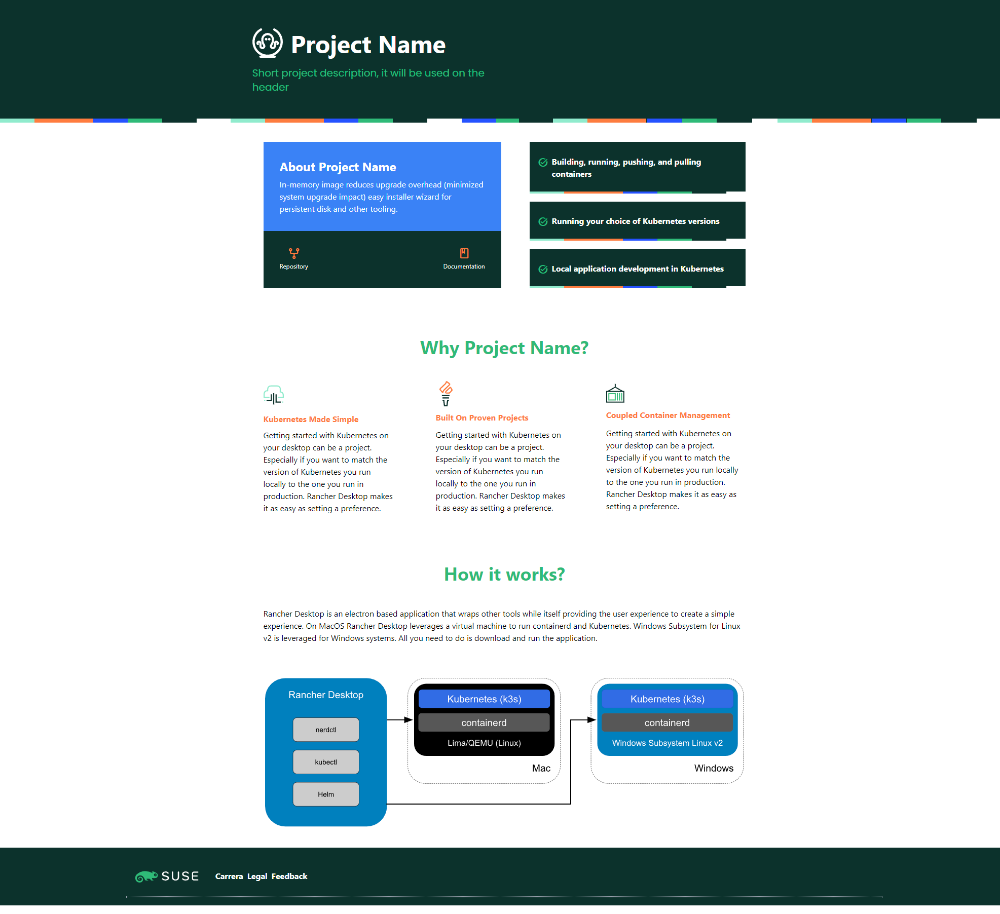

## Important!

💥 This is a POC and it's not ready for production.

---

## Getting Started

For development, please run the following commands:

```bash
# This will create an env file with all the things needed for local development (rewrites paths, etc.)
cp .template.env .env.development.local
```

\*Requieres [Node](https://nodejs.org/en/) installed.

```bash
npm install
# then:
npm run dev
# or
yarn dev
```

Project configuration can be found under `/db/project-info.js`. You'll need to fill it with your information and the changes would be reflected (live reload) at http://localhost:3000

---

## Build for production

You can serve the applications a Server-Side render with `npm start`. This will build the Production Ready application.

If you want to generate static files to serve as Static Site on Github Pages for example you should run `npm run static`. This will generate an `/out` folder with all the static files.

## Preview


